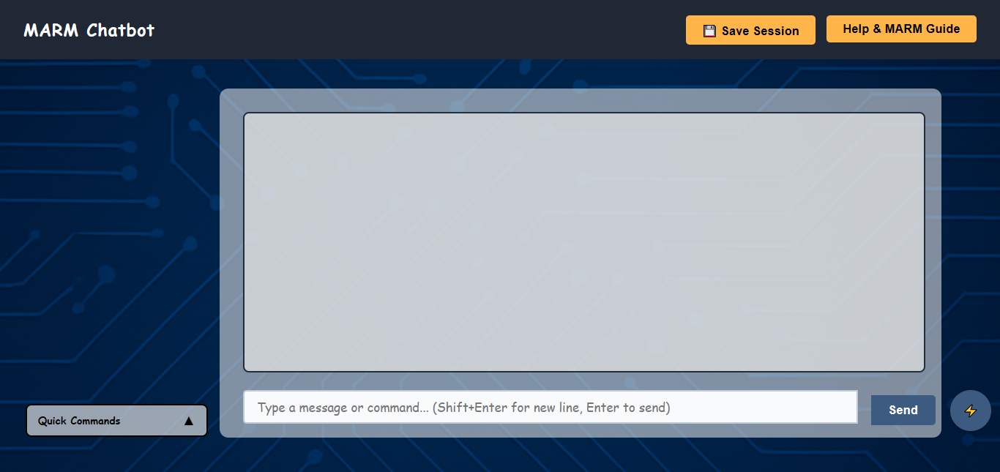
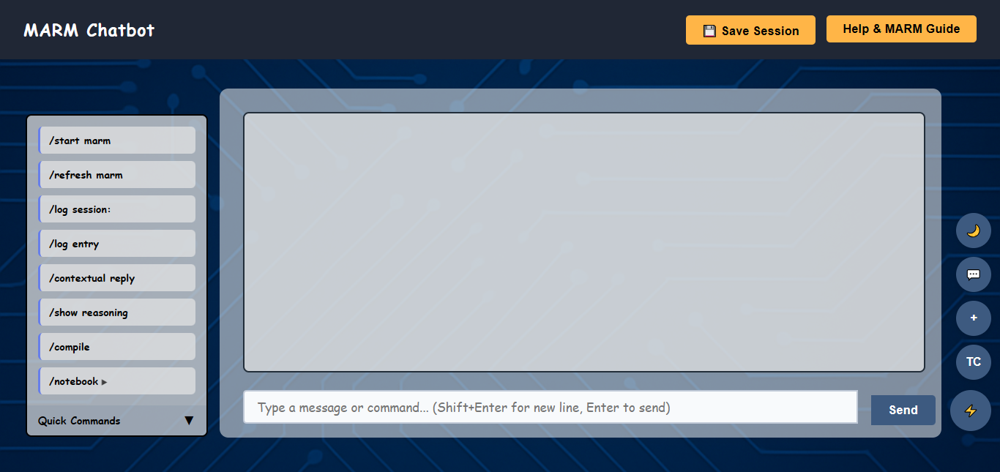
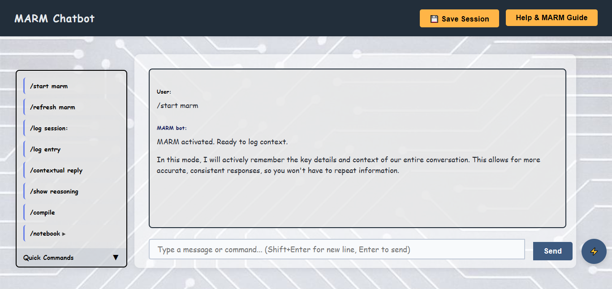

# MARM: Memory Accurate Response Mode v1.5.0 [](https://www.google.com/search?q=what+is+marm+memory+accurate+response+mode)   

**AI forgetting your project mid‑chat? MARM fixes that.** **Build smarter AI conversations with structured memory and transparent logic.**

  [](https://github.com/Lyellr88/MARM-Systems/blob/MARM-main/LICENSE)

**Last updated: August 8th, 2025** (**Coming Soon: visual walkthroughs and logic flowcharts**)

💥**Coming Soon to MARM Systems**💥
- Modern UI: Card-style chat, new colors, and interactive buttons
- Command Menu Overhaul: Redesigned commands and notebook menus
- Session Fixes: Persistent sessions and improved stability
- Security & Testing: Real XSS protection and full test suite
- Protocol Command Overhaul: Streamlined logging, context refresh, and notebook management

---

## 📌 Overview

MARM is a protocol for AI reliability. It gives you control over memory and logic by letting you log sessions, store your own notes, and compile summaries. The result: fewer hallucinations, transparent reasoning, and conversations that stay on track.  
**Steer the AI instead of chasing it.**

> For copy-and-paste prompt users and full technical details, see [`PROTOCOL.md`](./PROTOCOL.md)

[Try MARM Chatboy](https://marm-systems-chatbot.onrender.com) 

---

## 📄 Table of Contents  
- [Overview](#-overview)  
- [Who is Marm Built For?](#-built-for-research--real-use)  
- [Why MARM?](#-why-marm)  
- [Commands & Features](#-key-features--command-overview)  
- [Live Demo](#-try-marm-now---no-setup-required)  
- [Install Locally](#%EF%B8%8F-install-locally)  
- [Contributing](#-contributing--get-involved)  
- [Feedback](#-feedback--community-mentions)  
- [Project Files](#-project-files)

---

## 🧪 Built For Research + Real Use

MARM is both a power-user tool and a research scaffold:

**AI Safety & Reasoning Research**
- Study systematic reasoning in language models  
- Analyze memory persistence across sessions  
- Measure hallucination reduction with structured prompts  

**Business Intelligence**
- Maintain context across long analytical threads  
- Build organizational knowledge into sessions  
- Reinforce consistent decision-making frameworks  

**Educational & Training Use**
- Teach critical thinking via structured interaction  
- Build personalized learning repositories  
- Guide model reasoning with user-curated facts  

**Not built for:**  
Small talk • Throwaway chats • Passive use  

---

## ❓ Why MARM?

Modern LLMs often lose context or fabricate information. MARM introduces a session memory kernel, structured logs, and a user-controlled knowledge library. Anchoring the AI to *your* logic and data. It’s more than a chatbot wrapper. It’s a methodology for accountable AI.

### Read Before You Start

* Start MARM in a **new session** for best results  
* MARM **does not persist** across threads  
* To resume long sessions, use `/compile` and reseed manually  
* Commands are **manual by design** to ensure transparency and user control  

---

## 🔑 Key Features & Command Overview

### Key Features:

- **Session memory kernel** – Tracks user intent and prompts clarification  
- **Structured logs** – Use `/log` and `/compile` to build summaries  
- **Personal library** – Use `/notebook` to guide model outputs with your notes  
- **Accuracy guardrails** – Optional logic checks to reduce false outputs   

### Command Overview:

Session Commands
- `/start marm` → Activate protocol  
- `/refresh marm` → Reaffirm/reset context  

Core Commands
- `/log` → Start structured session logging  
- `/notebook` → Store key data  
- `/compile` → Summarize and reseed sessions  

Advanced Tools
- `/contextual reply` → Request context-aware response  
- `/show reasoning` → Reveal logic trail of last answer  

#### Quick Start (for copy and paste protocol)

```
/start marm  
/log entry [Date - Summary - Result]  
/compile SessionName --summary
```   

Need a walkthrough or troubleshooting help? The [`HANDBOOK.md`](./HANDBOOK.md) covers all aspects of using MARM.

---

<br><br>
<div align="center">
  <h3>🚀 Try MARM Now - No Setup Required</h3>
  <a href="https://marm-systems-chatbot.onrender.com">
    
  </a>
  <p><i>Experience all features instantly in your browser</i></p>
</div>
<br><br>
<div align="center">
  
  
  
</div>  

### User Experience (Chatbot)   

- **Save and revisit chat sessions** - Name and organize your conversations  
- **Start new chats instantly** - Fresh conversations with one click  
- **Built-in token counter** - Track your LLM usage  
- **Dark mode and custom backgrounds** - Easy on the eyes for long sessions  
- **Command menu for advanced control** - Quick access to all MARM features  
- **Notebook for persistent user knowledge** - Store your own notes and project data  
- **Session persistence** - Your chat stays active even if you refresh or close the page  
- **Voice synthesis** - Listen to MARM responses (Chrome/Edge recommended)  
- **Real-time MARM protocol** - All commands work exactly as documented  
- **No setup required** - Just open and start chatting  
- **Professional error handling** - Clear feedback when things go wrong

---


## 🛠️ Install Locally

Run MARM on your own machine using Google Gemini (Pro 2.5 Free Tier). Great for developers, power users, or those who want full control.

### Requirements
- Node.js v16+
- Git
- Gemini API Key (free or paid)

### 1. Clone the Repository
```bash
git clone https://github.com/Lyellr88/MARM-Systems.git
cd MARM-Systems/webchat
```

### 2. Install Dependencies

```bash
npm install
```

### 3. Add API Key

Create a `.env` file and add your Gemini key:

```bash
touch .env
echo "GEMINI_API_KEY=your_key_here" >> .env
```

### 4. Start the App

```bash
npm start
```

Then visit: [http://localhost:8080](http://localhost:8080)

---

**Need detailed steps, troubleshooting, or multi-provider setup?**
See [`SETUP.md`](./SETUP.md)

---

## 🤝 Contributing & Get Involved

I'm looking for contributors interested in:   
* **AI reasoning research** – Improve systematic thinking protocols
* **Framework development** – Enhance memory/accuracy layers
* **Evaluation metrics** – Score reasoning quality and reliability
* **Application research** – Explore new use cases and workflows

How to get involved:   
1. Try the [demo](https://marm-systems-chatbot.onrender.com) and share feedback
2. Open [issues](https://github.com/Lyellr88/MARM-Systems/issues) for bugs or features
3. Join GitHub discussions about AI reliability

---
 
## 📣 Feedback & Community Mentions

MARM is actively being tested and adopted across platforms.

- Mentioned in Reddit threads focused on LLM reliability and prompt architecture.
- Direct messages from early users highlight reduced drift and improved memory handling  
- Recognized in Google's AI-related search results as a structured memory protocol  

**Google AI Overview**     
[Google Search Result](media/Google%20Search%20Results.jpg)      

**Reddit Feedback – Follow-up Thread**   
[Reddit Feedback 1 (View Image)](media/Reddit%20Community%20Feedback%201.jpg)      

**Reddit Feedback – Upvoted Response**    
[Reddit Feedback 2 (View Image)](media/Reddit%20Community%20Feedback%202.jpg)      

*Additional feedback and screenshots will be added as adoption grows.*

---

## 📂 Project Files

- [README.md](README.md) – Core introduction and quick start for using MARM.  
- [FAQ.md](FAQ.md) – Answers to common questions about how and why to use MARM.  
- [CHANGELOG.md](CHANGELOG.md) – Tracks updates, edits, and refinements to the protocol.  
- [CONTRIBUTING.md](CONTRIBUTING.md) – Contribution guidelines and collaborator credits.  
- [DESCRIPTION.md](DESCRIPTION.md) – Protocol purpose and vision overview.  
- [LICENSE](LICENSE) – Terms of use for this project.
- [HANDBOOK.md](HANDBOOK.md) – Full guide to MARM usage, including commands, examples, and beginner to advanced tips.
- [ROADMAP.md](ROADMAP.md) – Planned features, upcoming enhancements, and related protocols under development.
- [SETUP.md](SETUP.md) - Local download setup guide.
- [PROTOCOL.md](PROTOCOL.md) - Quick Start, Copy and Paste Protocol, and Limitations.
